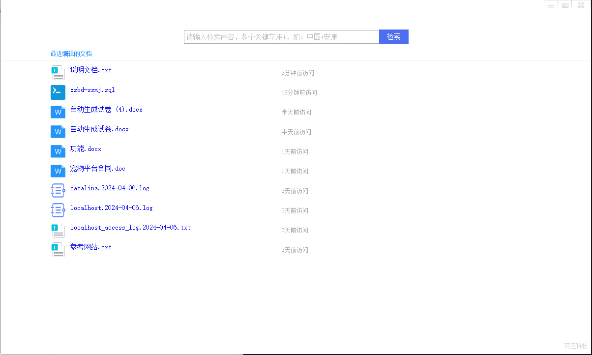
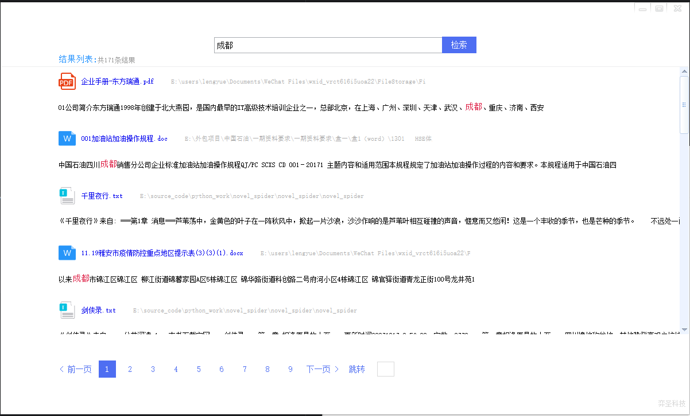

## 1.项目说明
本项目为打造PC端全文检索引擎，兼容XP系统，使用vs2013及其以上版本进行编译

### 1.1项目模块说明
 > TLCommon ：公共库项目，其他库可以引用

 > TLDataSearch ：UI项目
 
 > TLDocReader ： 文档读取项目

 > TLNetwork ： 网络库，用于版本检测

 > TLResourceMonitor ： 资源监控项目
 
### 1.2项目版权

## 2.编译
编译项目之前先安装vs2013及其以上版本

### 2.1编译代码
`git clone git@github.com:easaint/iSearch.git`

然后依次编译 TLCommon项目、TLNetwork、TLDocReader、TLResourceMonitor、TLDataSearch

编译完成之后，将TLOutput目录下的对应环境的库拷贝到编译输出目录，然后运行TLDataSearch项目，如图：

进行搜收关键字：

多关键字搜收：

